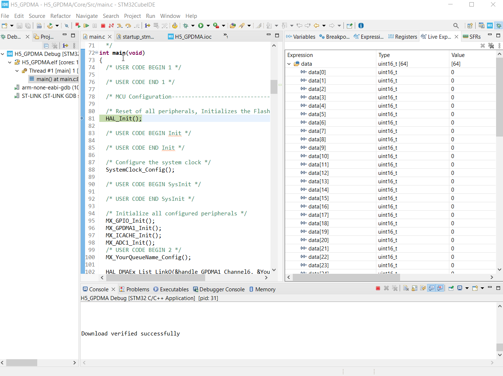
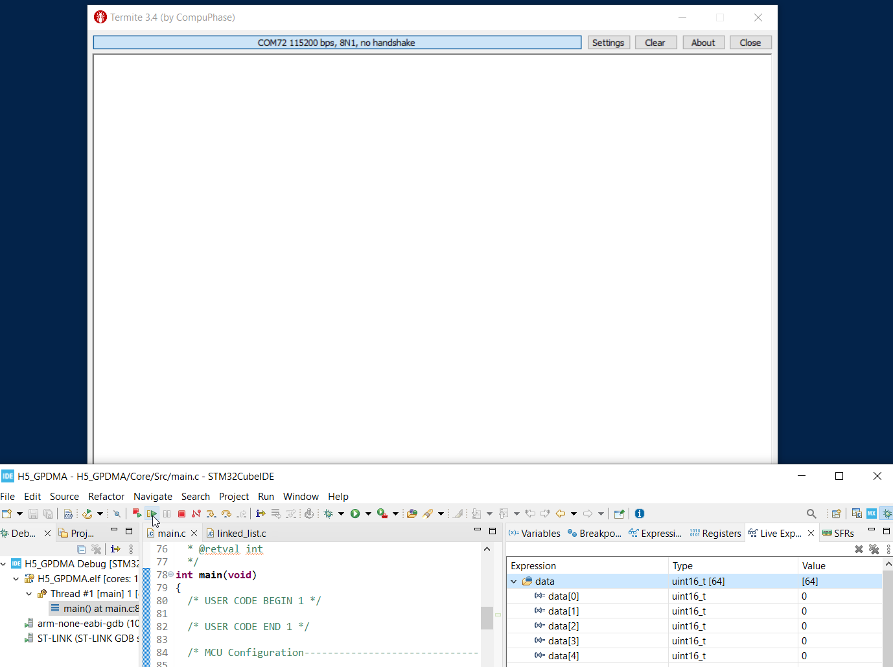
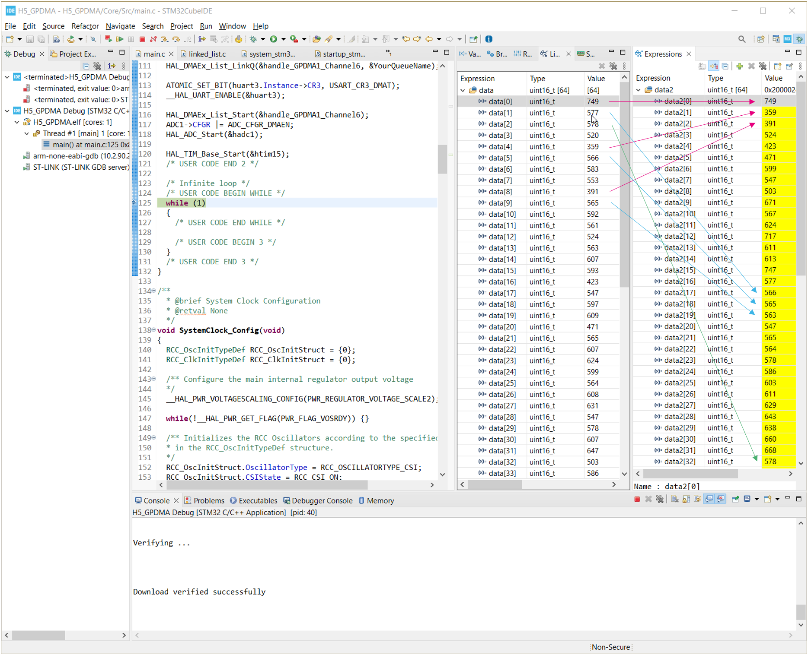

----!
Presentation
----!

# GPDMA introduction

# GPDMA STM32H563 demo 

Our goal is to show you **New Linked-list GPDMA feature**
with overview of advanced features

* Triggers
* 2D addresing
* Events

We will create application like this:

# **ADC** with LLI controlled GPDMA transfer [1/2]

## Our goal
* Use **NUCLEO-H563ZI board** and **STM32CubeIDE**
* Setup ADC to 
  * convert 4 channels in circle - channels 0, 2, 6, 13 
  * generate DMA requests
* Set GPDMA with linked list
  * To get data from ADC
  * Transfer them to buffer
* It allows us to add more nodes in later steps

## The GPDMA will use nodes for those registers: 

In our case each linked list node will update this GPDMA registers
after previous GPDMA node is finished. 

TR1 - Transfer register 1 
TR2 - Transfer register 2 
BR1 - Block register 1 
SAR - Source address register  
DAR - Destination address register 
TR3 - Transfer register 3 ... SA & DA offsets incremet for **2D**  
BR2 - Block register 2 ... block repeated SA & DA offsets for **2D** 
LLR - Linker list register ... link to next LL node & update parameters 
 
This is automatically reconfiguring the GPDMA channel. 
 

# ADC with **LLI controlled GPDMA** transfer - Linked List mode [2/2]

The GPDMA has **list** containing **configuration nodes** which are used by **GPDMA**.

When GPDMA ends it looking for new node configuration based on **LLR** register. If is found it reload own registrs with it also with new LLR.
This configuration is called **NODE**. Multiple nodes are **queue** making list. 

# **ADC** with **LLI controlled GPDMA transfer** - result

You can see changing values in buffer. 

# ADC+**UART** with LLI controlled GPDMA transfer

1. We add **UART 3** and configure it.
2. We add new node to our **GPDMA linked list**

# ADC+**UART** with LLI controlled GPDMA transfer - result
<awarning>
The ADC+UART are now working in loop. This may be very fast and it may also cause a crash of terminal.
</awarning>
 
 

# ADC+UART+**TIM** with LLI controlled GPDMA transfer

We can slow down the GPDMA by adding trigger.
As trigger source in our case we will use a timer TIM15 with period of 1s.
Then the GPDMA transfer will be conditioned by this trigger event. 

# ADC+UART+**TIM** with LLI controlled GPDMA transfer - result

Transmissions are batched every 1 second. Terminal application is not overloaded.

# ADC+UART+TIM+**2D** with LLI controlled GPDMA transfer

In current setup the channels from adc are stored in buffer like 
<red>CH1_a</red>, <green>CH2_a, CH3_a, CH4_a, CH1_b, CH2_b, CH3_b, CH4_b 
but we would like organization like 
CH1_a, CH1_b, CH2_a, CH2_b, CH3_a, CH3_b, CH4_a, CH4_b

For this we will use 2D addressing feature of GPDMA

# ADC+UART+TIM+**2D** with LLI controlled GPDMA transfer - result

We can check content of `data` and `data2`

# ADC+UART+TIM+2D+**EVENTS** with LLI controlled GPDMA transfer

The events can allow GPDMA to generate interrupts/events or disable this functionality so not interrupt/event wil be created by DMA channel. We will set GPDMA only to generte the event/interrupt with last node in list

We will add LED1's control as Heartbeat - faster, regular flashing 
and LED2's toggle at the end of transfer.

# ADC+UART+TIM+2D+**EVENTS** with LLI controlled GPDMA transfer - result

# GPDMA Hands-on cheat sheet

<asuccess>
You can go through this hands-on step by step yourself 
</asuccess>

Cheat sheet con you find at this link xxxxxxxxxxxxxxxxxxxxxxxxxxxxxxxxxxxx. 
It takes approximately 60 - 90 minutes.

