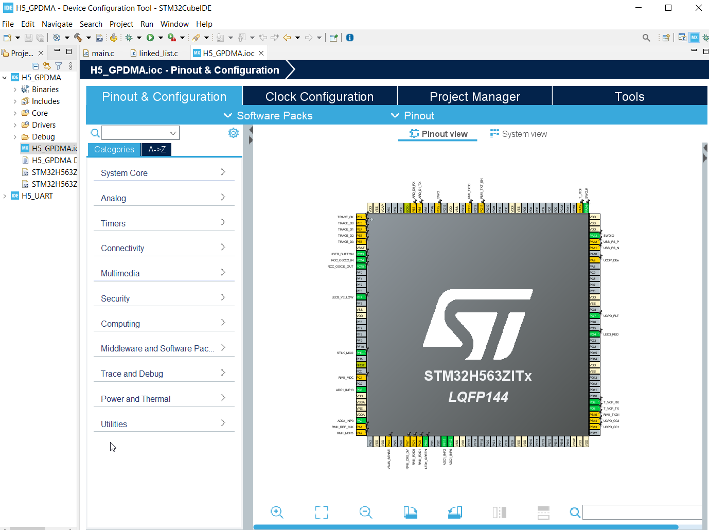
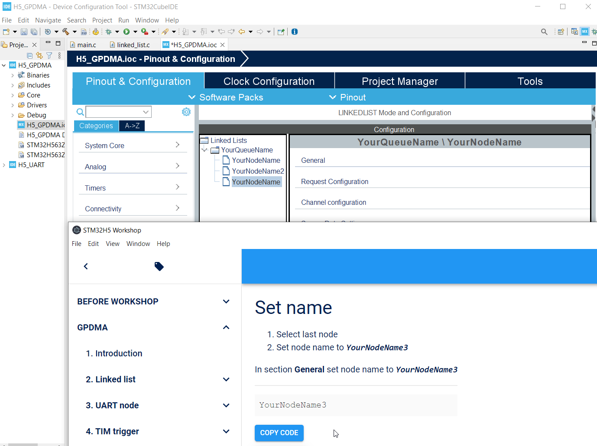
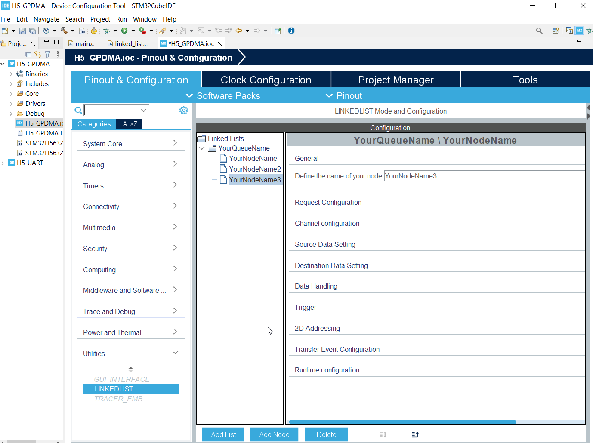
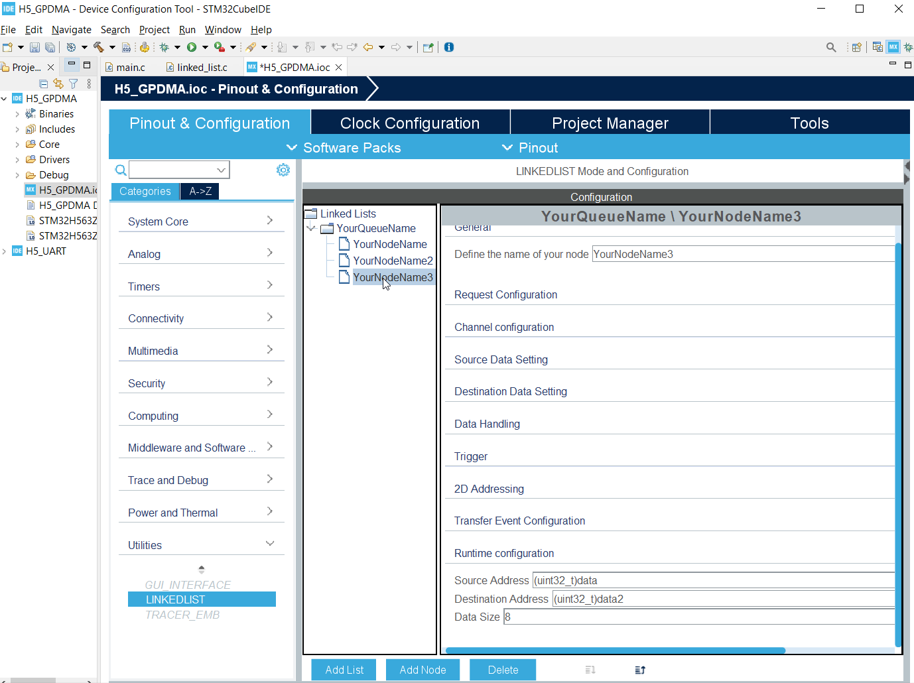

----!
Presentation
----!

# Select LINKEDLIST & Add new node

1. Select LINKEDLIST
2. Add new node



# Set name

1. Select last node
2. Set node name to `YourNodeName3`

In section **General** set node name to `YourNodeName3`

```c
YourNodeName3
```



# Set source and destination

1. In section **Source Data Settings** set **Source Address Increment After Transfer** to `ENABLE`
2. In section **Source Data Settings** set Data Width to Half-Word
3. In section **Source Data Settings** set **Destination Address Increment After Transfer** to `ENABLE`
4. In section **Source Data Settings** set Data Width to Half-Word


# Set 2D addresing

1. In section **2D addressing** set **Configuration** to `Enabled`
2. In section **2D addressing** set **Destination Address Offset** to `30` (16halfwords = 2*16bytes minus 2bytes)

```c
30
```

3. In section **2D addressing** set **Block Destination Address Offset** to `-126` (return to benning is 64*2bytes but we want to capture next sample so -1*2bytes)

```c
-126
```

4. In section **2D addressing** set **Repeat Counter** to `16` (we will transfer 4*2*16=128bytes = 64 samples)

```c
16
```


   
# Set Runtime configuration

1. In **Runtime configuration** set **Source Address** to `data`

```c
(uint32_t)data
```

2. In **Runtime configuration** set **Destination Address** to `data2`

```c
(uint32_t)data2
```

3. In **Runtime configuration** set **Data Size** to `8`

```c
8
```


# Modify node order

Set `YoutNodeName3` to middle position

1. Click on `YourNodeName3` 

2. Click to `Move up`



# Change UART source buffer

1. Select YoutNodeName2

2. Open section **Runtime configuration** set **Source Address** to `data2`

```c
(uint32_t)data2
```


# Generate code

**Generate code** and switch to `main.c`

# Add new buffer

In `main.c`

Add new buffer to section `/* USER CODE BEGIN PV */`

```c
uint16_t data2[64];
```


```c-nc
/* USER CODE BEGIN PV */
uint16_t data[64];
uint16_t data2[64];

extern DMA_QListTypeDef YourQueueName;
/* USER CODE END PV */
```

# Add buffer to linked_list.c

To file `linked_list.c`
To section `/* USER CODE BEGIN PM */` add

```c
extern uint16_t data2[];
```

like 

```c-nc
/* USER CODE BEGIN PM */
extern uint16_t data[];
extern uint16_t data2[];
/* USER CODE END PM */
```

# Node correction because of CubeMX

<aerror>
Mx contains an bug.

There is a missing part of configuration for YourNodeName2.
</aerror>

To file `linked_list.c` add
 
```c
  pNodeConfig.RepeatBlockConfig.RepeatCount = 1;
  pNodeConfig.RepeatBlockConfig.SrcAddrOffset = 0;
  pNodeConfig.RepeatBlockConfig.DestAddrOffset = 0;
  pNodeConfig.RepeatBlockConfig.BlkSrcAddrOffset = 0;
  pNodeConfig.RepeatBlockConfig.BlkDestAddrOffset = 0;
```

like

```c-nc
  /* Set node configuration ################################################*/
  pNodeConfig.Init.Request = GPDMA1_REQUEST_USART1_TX;
  pNodeConfig.Init.Direction = DMA_MEMORY_TO_PERIPH;
  pNodeConfig.Init.DestInc = DMA_DINC_FIXED;
  pNodeConfig.Init.SrcDataWidth = DMA_SRC_DATAWIDTH_BYTE;
  pNodeConfig.Init.DestDataWidth = DMA_DEST_DATAWIDTH_BYTE;
  pNodeConfig.Init.TransferEventMode = DMA_TCEM_BLOCK_TRANSFER;
  pNodeConfig.RepeatBlockConfig.RepeatCount = 1;
  pNodeConfig.RepeatBlockConfig.SrcAddrOffset = 0;
  pNodeConfig.RepeatBlockConfig.DestAddrOffset = 0;
  pNodeConfig.RepeatBlockConfig.BlkSrcAddrOffset = 0;
  pNodeConfig.RepeatBlockConfig.BlkDestAddrOffset = 0;
  pNodeConfig.SrcAddress = data2;
  pNodeConfig.DstAddress = &(USART1->TDR);
  pNodeConfig.DataSize = (64*2);
  ```

# Now compile and run application

Compile code and run debug we can check content of `data` and `data2`


# What we created

We added new node which can sort the content before is sent over by UART


