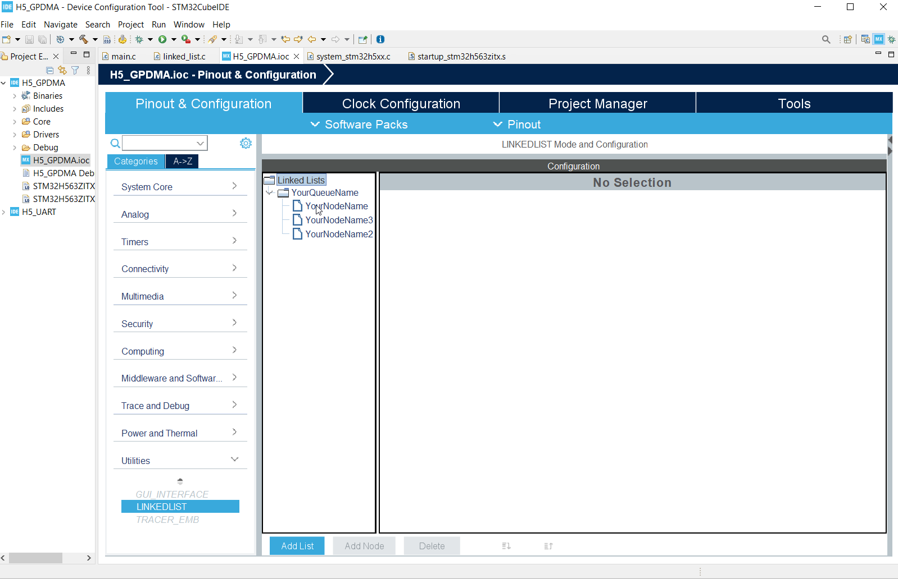
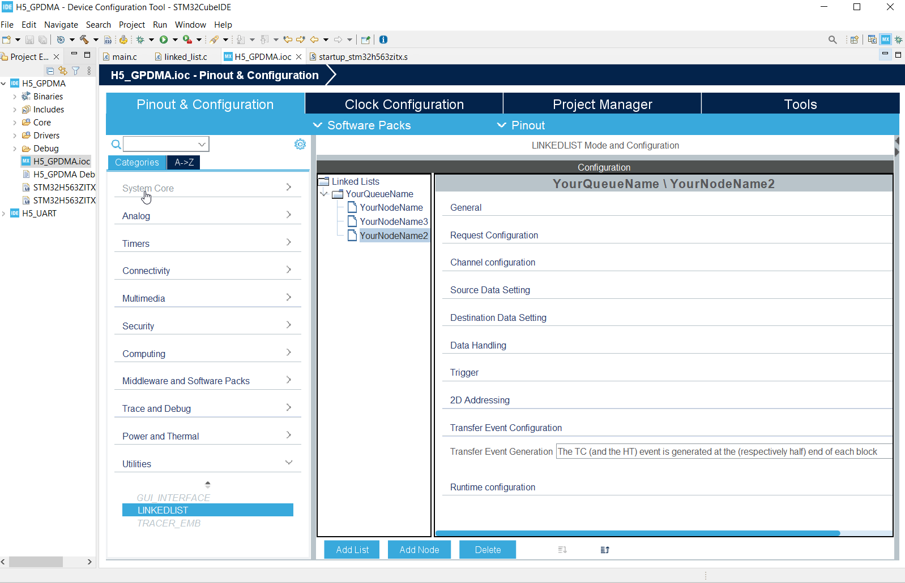

----!
Presentation
----!

# Select linked list

1. Open `LINKEDLIST`
2. Select `YourNodeName` node
3. In **Transfer Event Generation** section set **Transfer Event Generation** to `The TC event is generate at the end of the last linked-list item`
4. Select `YourNodeName3` node
5. In **Transfer Event Generation** section set **Transfer Event Generation** to `The TC event is generate at the end of the last linked-list item`
6. Select `YourNodeName2` node
7. In **Transfer Event Generation** section set **Transfer Event Generation** to `The TC event is generate at the end of each block`



Because we are in loop the `end of the last linked-list item` condition is newer met so node willl not generate any event/interrupt. 
Only `YourNodeName2` will generate event/interrupt for each block. We have only one block so one interrupt

# Select GPDMA1

Enable IRQ service in `NVIC Settings`




# Generate code

Click on **Generate Code** and switch to `main.c`

# Create callback 

Create callback function like bellow by adding it to `/* USER CODE BEGIN 0 */` section

```c
void GPDMA_TransmitComplete(DMA_HandleTypeDef *hdma){
  // end of each transfer toggle yellow LED
  HAL_GPIO_TogglePin(LED2_YELLOW_GPIO_Port, LED2_YELLOW_Pin);
}
```

```c-nc
/* USER CODE BEGIN 0 */
void GPDMA_TransmitComplete(DMA_HandleTypeDef *hdma){
  // end of each transfer toggle yellow LED
  HAL_GPIO_TogglePin(LED2_YELLOW_GPIO_Port, LED2_YELLOW_Pin);
}
/* USER CODE END 0 *
```

set it as function prototype in section `/* USER CODE BEGIN PFP */`

```c
void GPDMA_TransmitComplete(DMA_HandleTypeDef *hdma);
```

```c-nc
/* USER CODE BEGIN PFP */
void GPDMA_TransmitComplete(DMA_HandleTypeDef *hdma);
/* USER CODE END PFP */
```

# Set calback and IT

set callback to GPDMA handle `handle_GPDMA1_Channel6` snad start GPDMA by `HAL_DMAEx_List_Start_IT` (we are replacing `HAL_DMAEx_List_Start`)
In section ` /* USER CODE BEGIN 2 */`

```c
  handle_GPDMA1_Channel6.XferCpltCallback=GPDMA_TransmitComplete;
  HAL_NVIC_EnableIRQ(GPDMA1_Channel6_IRQn);
  HAL_DMAEx_List_Start_IT(&handle_GPDMA1_Channel6);
```


```c-nc
  /* USER CODE BEGIN 2 */
  MX_ADCQueue_Config();
  
  HAL_DMAEx_List_LinkQ(&handle_GPDMA1_Channel6, &ADCQueue);
  /* without IRQ */
//  HAL_DMAEx_List_Start(&handle_GPDMA1_Channel6);
  
  /* with IRQ at the END */
  handle_GPDMA1_Channel6.XferCpltCallback=GPDMA_TransmitComplete;
  HAL_NVIC_EnableIRQ(GPDMA1_Channel6_IRQn);
  HAL_DMAEx_List_Start_IT(&handle_GPDMA1_Channel6);  
  
  USART3->CR3 |= USART_CR3_DMAT;
  __HAL_UART_ENABLE(&huart3);
    
  ADC1->CFGR |= ADC_CFGR_DMAEN;
  HAL_ADC_Start(&hadc1);
  
  HAL_TIM_Base_Start(&htim15);
  /* USER CODE END 2 */
  ```

# Set green LED as heart beat

Toggle green led in In section `/* USER CODE BEGIN 3 */`

```c
    HAL_GPIO_TogglePin(LED1_GREEN_GPIO_Port, LED1_GREEN_Pin);
    HAL_Delay(150);
```


```c-nc
    /* USER CODE BEGIN 3 */
    HAL_GPIO_TogglePin(LED1_GREEN_GPIO_Port, LED1_GREEN_Pin);
    HAL_Delay(150);
  }
  /* USER CODE END 3 */
 ```

# Node correction because of CubeMX

<aerror>
Mx contains an bug.

There is a missing part of configuration for YourNodeName2.
</aerror>

To file `linked_list.c` add
 
```c
  pNodeConfig.RepeatBlockConfig.RepeatCount = 1;
  pNodeConfig.RepeatBlockConfig.SrcAddrOffset = 0;
  pNodeConfig.RepeatBlockConfig.DestAddrOffset = 0;
  pNodeConfig.RepeatBlockConfig.BlkSrcAddrOffset = 0;
  pNodeConfig.RepeatBlockConfig.BlkDestAddrOffset = 0;
```

like

```c-nc
  /* Set node configuration ################################################*/
  pNodeConfig.Init.Request = GPDMA1_REQUEST_USART1_TX;
  pNodeConfig.Init.Direction = DMA_MEMORY_TO_PERIPH;
  pNodeConfig.Init.DestInc = DMA_DINC_FIXED;
  pNodeConfig.Init.SrcDataWidth = DMA_SRC_DATAWIDTH_BYTE;
  pNodeConfig.Init.DestDataWidth = DMA_DEST_DATAWIDTH_BYTE;
  pNodeConfig.Init.TransferEventMode = DMA_TCEM_BLOCK_TRANSFER;
  pNodeConfig.RepeatBlockConfig.RepeatCount = 1;
  pNodeConfig.RepeatBlockConfig.SrcAddrOffset = 0;
  pNodeConfig.RepeatBlockConfig.DestAddrOffset = 0;
  pNodeConfig.RepeatBlockConfig.BlkSrcAddrOffset = 0;
  pNodeConfig.RepeatBlockConfig.BlkDestAddrOffset = 0;
  pNodeConfig.SrcAddress = data2;
  pNodeConfig.DstAddress = &(USART1->TDR);
  pNodeConfig.DataSize = (64*2);
  ```

# Now compile and run application


# What we have 

We added events to our application generated at specific point. 
And we can handle IRQ from GPDMA
