----!
Presentation
----!

# I3C hands-on: Introduction

Goal of this hand-ons is to create simple I3C example, communicating with [LSM6DSO](https://www.st.com/en/mems-and-sensors/lsm6dso.html) sensor on [X-Nucleo-IKS01A3](https://www.st.com/en/ecosystems/x-nucleo-iks01a3.html) board.

In order for this example to work with X-Nucleo-IKS01A3 board, two jupmers highlighted on picture below need to be removed. This will disconnect most of the sensors from I<sup>2</sup>C/I3C bus

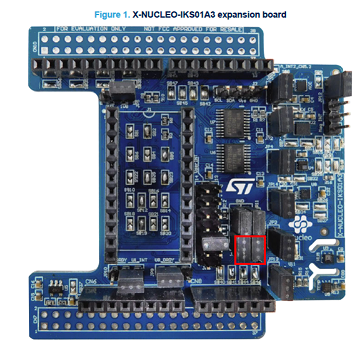

We will use [X-CUBE-MEMS1](https://www.st.com/en/embedded-software/x-cube-mems1.html) extension package. This extension can be downloaded inside STM32CubeMX or STM32CubeIDE.
It will allow us quickly setup LSM6DSO registers and create simple demo application.

At the moment (May 2023), the X-CUBE-MEMS1 package doesn't support I3C, so we will modify the project to use I3C instead via small hacks.

# Create new project (1/2)

1. Create new project in STM32CubeIDE.
	* Make sure you are using version 1.12.0.
2. Start by selecting **NUCLEO-H563ZI board**
	* This will initialize the LEDs and push buttons automatically

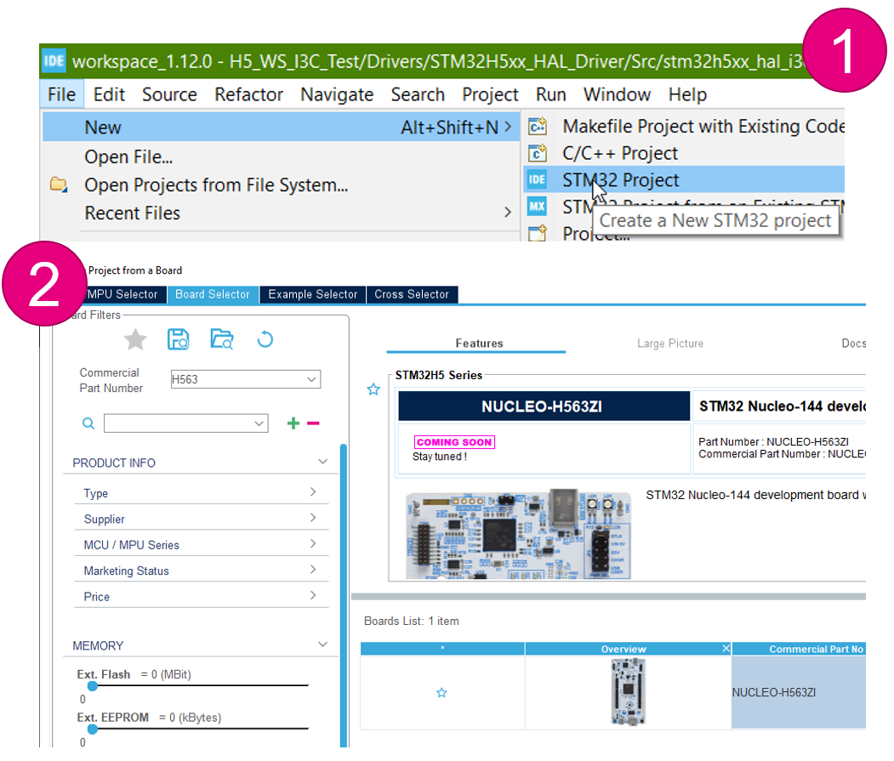


# Create new project (2/2)

1. **Name** the project, leave rest of values to default
2. When prompted "Initialize all peripherals in default mode", select **Yes**
	* This should configure USART3 and ICACHE, so we don’t need to do it manually

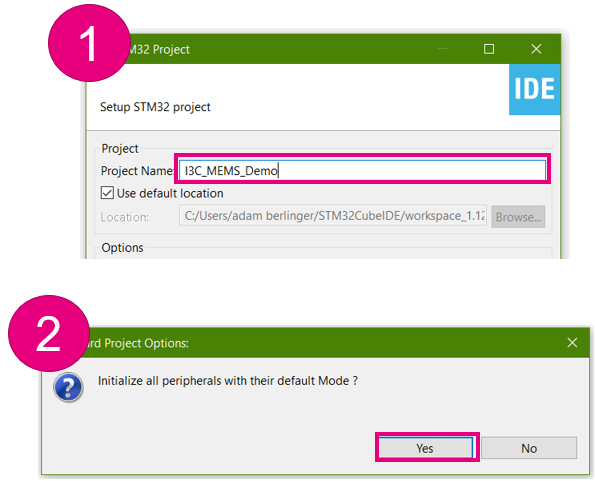

# Configure I3C peripheral

1. Enable I3C1 in **Controller** mode <br />
	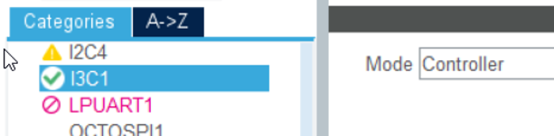
2. Enable event & error interrupts in NVIC <br />
	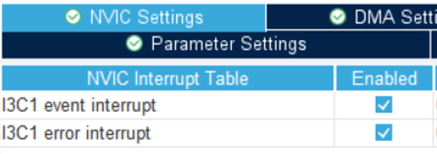
3. Set Mixed I3C and I2C and modify the frequencies <br />
	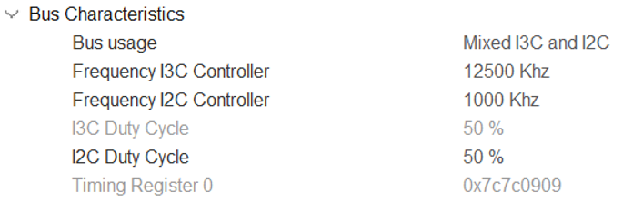
	
# Move I3C pins to PB8/PB9

To move pins:
1. CTRL + left-click on the pin to see alternative pins
2. Drag & drop

Alternatively you can also click directly on PB8 and PB9 and select the function

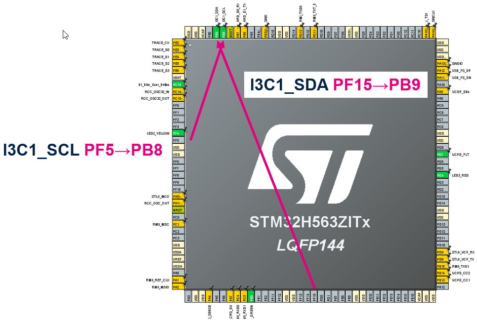

We can leave the default GPIO setting

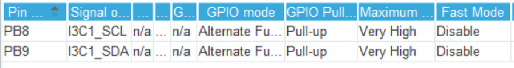

# Configure PE14 as EXTI

Pin PE14 is connected to LSM6DSO interrupt output. In our application we will use I3C in-band interrupt (IBI), but for configuring X-CUBE-MEMS1 package we need this pin.
We will configure it as GPIO_EXTI.

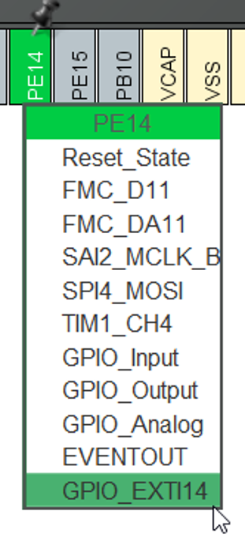

We will also enable the interrupt in **GPIO** > **NVIC** configuration. This will generate code for the corresponding interrupt handler.

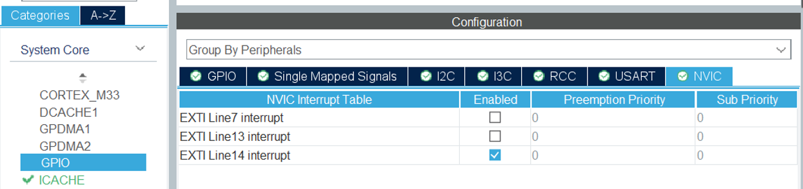

# Enable I<sup>2</sup>C2

Enable I2C with default settings.
The X-CUBE-MEMS1 package requires I<sup>2</sup>C to work properly at the moment. We will overwrite this in the code itself, but we need some I<sup>2</sup>C peripheral to configure the package correctly.

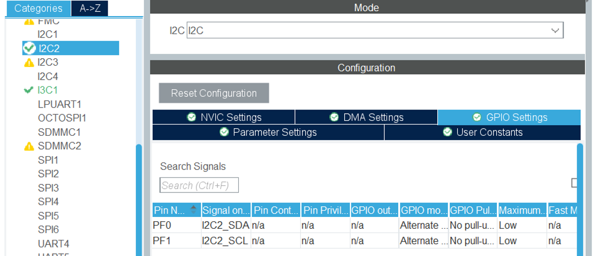

# Enable USART3

_**This step should be done automatically when creating project with "Initialize all peripherals in default mode"**_

Enable USART3 in **Asynchronous** mode
Leave the default configuration (115200 baudrate, 8-bits without parity)

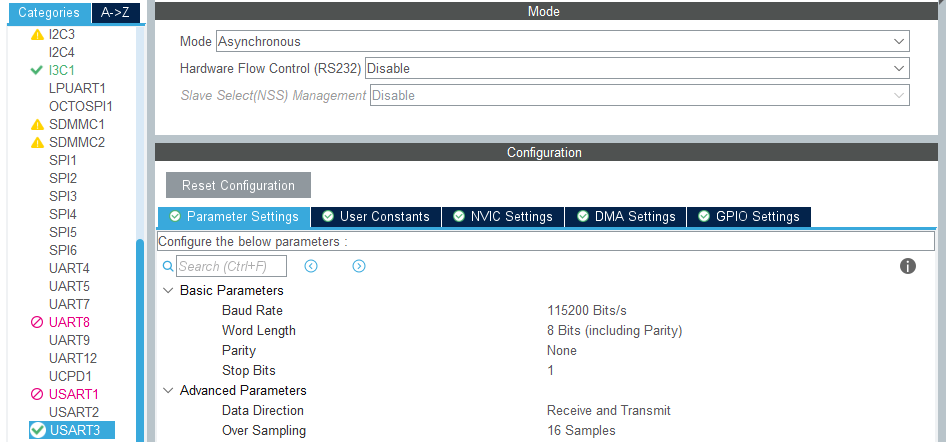

# Enable ICache

_**This step should be done automatically when creating project with "Initialize all peripherals in default mode"**_

Enable ICACHE in **1-way (direct mapped cache)** mode (or **2-way set associative cache**).
This is just to get rid of a warning when generating the code, not essential for this demo!

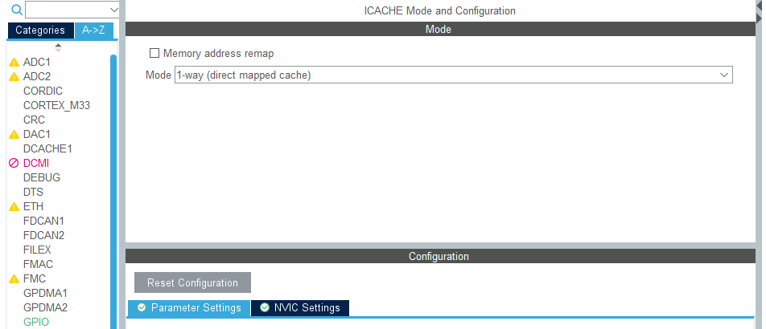

# Enable X-CUBE-MEMS1 component

1. Go to **Software Packs** > **Select Components** and select **X-CUBE-MEMS1** <br />
	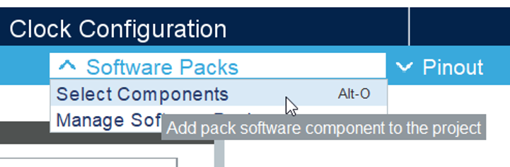
2. Enable **_Device_ MEMS1_Applications** with **IKS01A3_LSM6DSO_WakeUp** selected <br />
	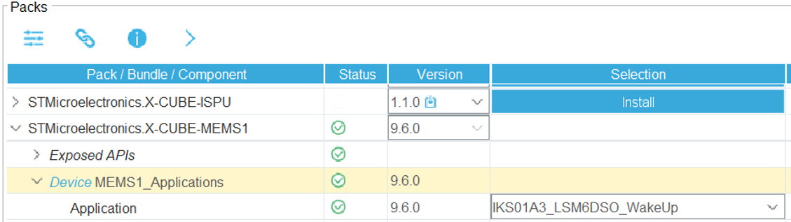
3. Enable **_Board Extension_ IKS01A3** <br />
	

# Configure X-CUBE-MEMS1 component

1. Enable X-CUBE-MEMS1 in **Middleware**, both **Board Extension IKS01A3** and **Device MEMS1 Applications** <br />
	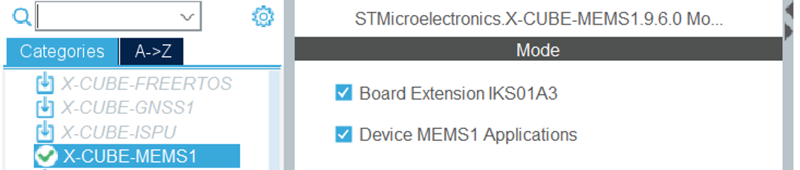
2. Configure Platform settings <br />
	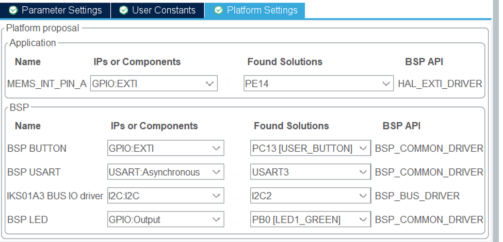
	
# Configure MX_I3C1_Init properties

1. Go to **Project Manager** > **Advanced Settings**
2. Select **MX_I3C1_Init** function
	* [x] Check **Do Not Generate Function Call** checkbox
	* [ ] Un-check **Visibility (Static)** checkbox
3. Generate code

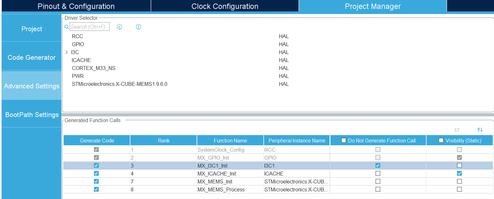

# Exclude stm32h5xx_util_i3c.c

1. Locate file Drivers\STM32H5xx_HAL_Driver\Src\stm32h5xx_util_i3c.c
2. Right-click on file and select Resource Configurations > Exclude from Build...
3. Check both Debug and Release

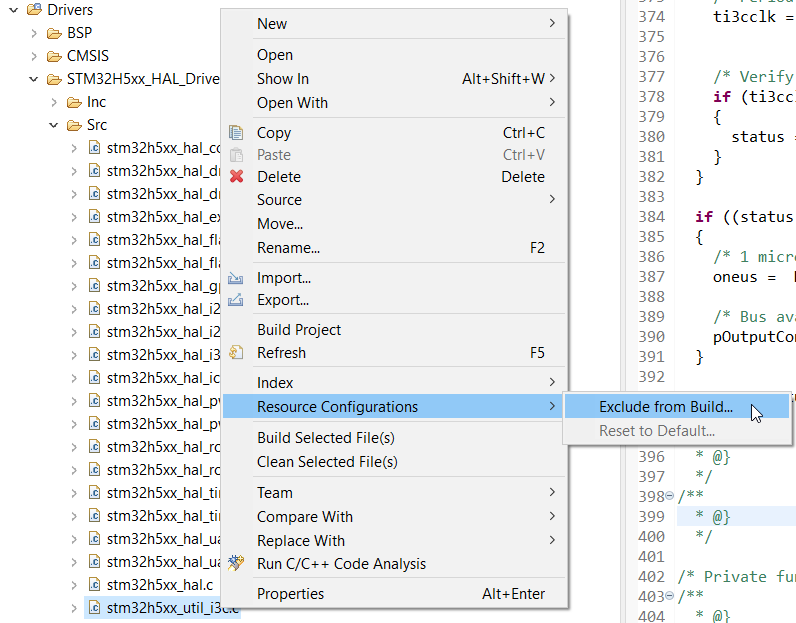
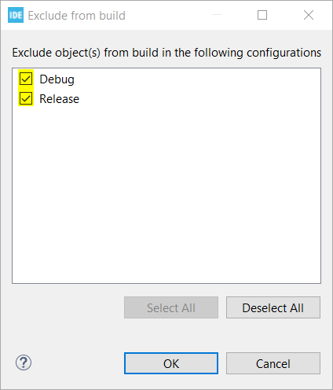

# Create Core\Src\i3c_reg_io.c

Create new source file Core\Src\i3c_reg_io.c with following content:

```c
#include "i3c_reg_io.h"
#include <stdio.h>

/* Handle for I3C */
extern I3C_HandleTypeDef hi3c1;

/* Notifications to be passed from IRQ during enumeration */
static volatile uint32_t uwTargetCount = 0;
static volatile uint32_t uwEnumDone = 0;
static volatile uint64_t lastTargetID = 0;

int32_t BSP_I3C_Init(void){
    /* Struct for configuring IBI reception */
	I3C_DeviceConfTypeDef DeviceConf;

	/* Call MX generated initialization */
	MX_I3C1_Init();

	/* Begin enumeration (dynamic address assignment) process.
	 * Reset dynamic address first (is necessary if only MCU is reset).
	 */
	printf("Starting enumeration...\n");
	HAL_I3C_Ctrl_DynAddrAssign_IT(&hi3c1, I3C_RSTDAA_THEN_ENTDAA);

	/* Wait for enumeration to be finished */
	while(uwEnumDone == 0);

	/* Report I3C device parameters
	 * Expected output (for LSM6DSO):
	 * DCR = 0x44, BCR = 0x7
	 * Full ID =  0x44070b106c000802
	 */
	printf("Enumeration done successfully...\n");
	printf("DCR = 0x%02x, BCR = 0x%02x\nFull ID = 0x%08x%08x\n",
			(unsigned int)((lastTargetID >> 56) & 0xFF), (unsigned int)((lastTargetID >> 48) & 0xFF),
			(unsigned int)((lastTargetID >> 32) & 0xFFFFFFFFUL), (unsigned int)(lastTargetID & 0xFFFFFFFFUL));

	/* Configure and enable in-band interrupt (IBI) */
	DeviceConf.DeviceIndex = 1;
	DeviceConf.TargetDynamicAddr = (0xD7 >> 1);
	DeviceConf.CtrlRoleReqAck = DISABLE;
	DeviceConf.CtrlStopTransfer = DISABLE;
	DeviceConf.IBIAck = ENABLE;
	DeviceConf.IBIPayload = ENABLE;
	HAL_I3C_Ctrl_ConfigBusDevices(&hi3c1, &DeviceConf, 1);

	/* Enable IBI interrupt inside I3C peripheral */
	HAL_I3C_ActivateNotification(&hi3c1, NULL, HAL_I3C_IT_IBIIE);

	return 0;
}

/* Variable for sending event to MEMS application */
extern volatile uint8_t MemsEventDetected;
volatile I3C_CCCInfoTypeDef CCCInfo;

void HAL_I3C_NotifyCallback(I3C_HandleTypeDef *hi3c, uint32_t eventId)
{
  if ((eventId & EVENT_ID_IBI) == EVENT_ID_IBI)
  {
	  /* Process IBI request */

	  /* Notify MEMS application */
	  MemsEventDetected = 1;
	  /* Read additional data from the interrupt payload.
	   * Not used in this example.
	   */
	  HAL_I3C_GetCCCInfo(hi3c, EVENT_ID_IBI, (I3C_CCCInfoTypeDef*)&CCCInfo);
  }
}

void HAL_I3C_TgtReqDynamicAddrCallback(I3C_HandleTypeDef *hi3c, uint64_t targetPayload)
{
  /* Assign address based on targetPayload */
  /* Here we expect only single I3C target present on the bus */

  /* Send associated dynamic address */
  HAL_I3C_Ctrl_SetDynAddr(hi3c, (0xD7 >> 1) + uwTargetCount);
  uwTargetCount++;

  /* Store target ID */
  lastTargetID = targetPayload;
}

void HAL_I3C_CtrlDAACpltCallback(I3C_HandleTypeDef *hi3c)
{
  /* Enumeration completed */
  uwEnumDone = 1;
}


void HAL_I3C_ErrorCallback(I3C_HandleTypeDef *hi3c){
	if(uwEnumDone == 0){
		printf("Enumeration failed...\n");
	}
}

int32_t BSP_I3C_DeInit(void){
	HAL_I3C_DeInit(&hi3c1);
	return 0;
}

int32_t BSP_I3C_WriteReg(uint16_t Addr, uint16_t Reg, uint8_t *pData, uint16_t Length){
	/* Wait until previous transfer finish */
	while(!LL_I3C_IsActiveFlag_CFE(hi3c1.Instance));

	/* Start private write transfer (1+N byte = register start address + register values) */
	LL_I3C_ControllerHandleMessage(hi3c1.Instance,Addr >> 1, Length+1, LL_I3C_DIRECTION_WRITE,
			LL_I3C_CONTROLLER_MTYPE_PRIVATE, LL_I3C_GENERATE_STOP);

	/* Send register start address */
	LL_I3C_TransmitData8(hi3c1.Instance, (uint8_t)(Reg & 0xFF));

	while(1){
		/* Check if we can write more data */
		if(LL_I3C_IsActiveFlag_TXFNF(hi3c1.Instance)) {
			if(Length > 0){
				if(Reg == 0x18){
					/* Hack to prevent disabling I3C by X-Cube-MEMS in LSM6DSO */
					/* Filter out disabling of I3C interface in CTRL_9_XL register */
					LL_I3C_TransmitData8(hi3c1.Instance, (*pData) & 0xFD);
				}
				else {
					LL_I3C_TransmitData8(hi3c1.Instance, *pData);
				}
				Reg++;
				pData++;
				Length--;
			}
		}
		/* Check for error flag */
		if(LL_I3C_IsActiveFlag_ERR(hi3c1.Instance)){
			LL_I3C_ClearFlag_ERR(hi3c1.Instance);
			return -1;
		}
		/* Check if the transfer has finished */
		if(LL_I3C_IsActiveFlag_FC(hi3c1.Instance)){
			LL_I3C_ClearFlag_FC(hi3c1.Instance);
			return (Length == 0)?0:-1;
		}
	}
	return 0;
}


int32_t BSP_I3C_ReadReg(uint16_t Addr, uint16_t Reg, uint8_t *pData, uint16_t Length){
	/* Wait until previous transfer finish */
	while(!LL_I3C_IsActiveFlag_CFE(hi3c1.Instance));

	/* Start private write transfer (1 byte = register start address) */
	LL_I3C_ControllerHandleMessage(hi3c1.Instance,Addr >> 1, 1, LL_I3C_DIRECTION_WRITE,
			LL_I3C_CONTROLLER_MTYPE_PRIVATE, LL_I3C_GENERATE_RESTART);

	/* Send register start address */
	LL_I3C_TransmitData8(hi3c1.Instance, (uint8_t)(Reg & 0xFF));

	/* Start private read transfer (N bytes = register values) */
	LL_I3C_ControllerHandleMessage(hi3c1.Instance,Addr >> 1, Length, LL_I3C_DIRECTION_READ,
			LL_I3C_CONTROLLER_MTYPE_PRIVATE, LL_I3C_GENERATE_STOP);

	while(1){
		/* Check if we can write new data */
		if(LL_I3C_IsActiveFlag_RXFNE(hi3c1.Instance)) {
			if(Length > 0){
				*pData = LL_I3C_ReceiveData8(hi3c1.Instance);
				pData++;
				Length--;
			}
		}
		/* Check for error flag */
		if(LL_I3C_IsActiveFlag_ERR(hi3c1.Instance)){
			LL_I3C_ClearFlag_ERR(hi3c1.Instance);
			return -1;
		}
		/* Check if the transfer has finished */
		if(LL_I3C_IsActiveFlag_FC(hi3c1.Instance)){
			LL_I3C_ClearFlag_FC(hi3c1.Instance);
			return (Length == 0)?0:-1;
		}
	}
	return 0;
}
```

# Create Core\Inc\i3c_reg_io.c

Create new source file Core\Inc\i3c_reg_io.h with following content:

```c
#ifndef __I3C_REG_IO_H
#define __I3C_REG_IO_H

#include "main.h"

#ifdef __cplusplus
extern "C" {
#endif


int32_t BSP_I3C_Init(void);
int32_t BSP_I3C_DeInit(void);
int32_t BSP_I3C_WriteReg(uint16_t Addr, uint16_t Reg, uint8_t *pData, uint16_t Length);
int32_t BSP_I3C_ReadReg(uint16_t Addr, uint16_t Reg, uint8_t *pData, uint16_t Length);

#ifdef __cplusplus
}
#endif

#endif /* __MAIN_H */
```

# Modify iks01a3_conf.h

Modify user code section in file MEMS\Target\iks01a3_conf.h:

```c
/* USER CODE BEGIN 1 */
#include "i3c_reg_io.h"

#define USE_IKS01A3_ENV_SENSOR_HTS221_0                1U
#define USE_IKS01A3_ENV_SENSOR_LPS22HH_0               1U
#define USE_IKS01A3_ENV_SENSOR_STTS751_0               1U

#define USE_IKS01A3_MOTION_SENSOR_LSM6DSO_0            1U
#define USE_IKS01A3_MOTION_SENSOR_LIS2DW12_0           0U
#define USE_IKS01A3_MOTION_SENSOR_LIS2MDL_0            0U

#define IKS01A3_I2C_Init BSP_I3C_Init
#define IKS01A3_I2C_DeInit BSP_I3C_DeInit
#define IKS01A3_I2C_ReadReg BSP_I3C_ReadReg
#define IKS01A3_I2C_WriteReg BSP_I3C_WriteReg
#define IKS01A3_GetTick BSP_GetTick
#define IKS01A3_Delay HAL_Delay

#ifdef __cplusplus
}
#endif

#endif /* __IKS01A3_CONF_H__*/

/* Discard rest of the file */
#if 0
/* USER CODE END 1 */
```

This will overwrite the BSP to use I3C functions we created in i3c_reg_io.c/.h files.

# Modify main.c

Modify MX_I3C1_Init function to change the timing for I3C.
At the moment the STM32CubeMX allows only configuration wiht hight pulse <50ns. This is unfortunately not compatible with level shifter on X-Nucleo-IKS01A3 board

```c
  /* USER CODE END I3C1_Init 1 */
  hi3c1.Instance = I3C1;
  hi3c1.Mode = HAL_I3C_MODE_CONTROLLER;
  hi3c1.Init.CtrlBusCharacteristic.SDAHoldTime = HAL_I3C_SDA_HOLD_TIME_1_5;
  hi3c1.Init.CtrlBusCharacteristic.WaitTime = HAL_I3C_OWN_ACTIVITY_STATE_0;
  hi3c1.Init.CtrlBusCharacteristic.SCLPPLowDuration = 0x7c;   /* <---- */
  hi3c1.Init.CtrlBusCharacteristic.SCLI3CHighDuration = 0x7c; /* <---- */
  hi3c1.Init.CtrlBusCharacteristic.SCLODLowDuration = 0x7c;
  hi3c1.Init.CtrlBusCharacteristic.SCLI2CHighDuration = 0x7c;
  hi3c1.Init.CtrlBusCharacteristic.BusFreeDuration = 0x6a;
  hi3c1.Init.CtrlBusCharacteristic.BusIdleDuration = 0xf8;
  if (HAL_I3C_Init(&hi3c1) != HAL_OK)
  {
    Error_Handler();
  }

```


